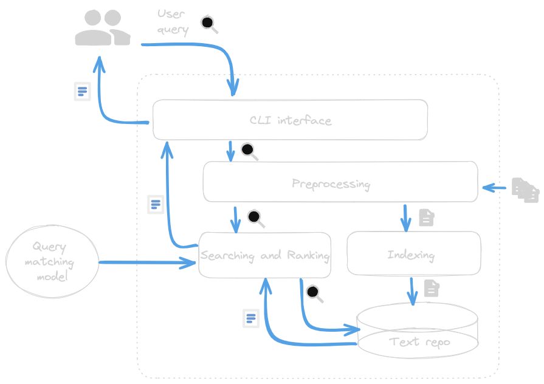

# Everpapers, a thematic search engine

🚧   🚧


## Project description

This repository contains the evolution of the Information Retrieval project. Everpapers is a vertical search engine built upon a corpus of documents sourced from CORE (COnnecting REpositories), a public repository of open-access research papers. 
The goal is to provide a more refined search experience than CORE [portal](https://core.ac.uk).
It uses the [Okapi BM25](https://en.wikipedia.org/wiki/Okapi_BM25) ranking function to estimate the relevance of documents.
End users can formulate queries based on a defined language, results are presented in order of relevance with title, abstract, and score.

## Architecture

<!-- ### Store first-query later approach -->




<!-- ### Preprocessing stage

 -->


## Running the project

### Install required Python libraries
```
pip3 install -r requirements.txt
```
### Install NLTK data

```
import nltk
nltk.download('punkt')
nltk.download('stopwords')
nltk.download('omw-1.4')
nltk.download('wordnet')
nltk.download('averaged_perceptron_tagger')
```
### Setup environment
```
sh setup_scripts/01.prepare_environment.sh 
```
### Usage
```
python3 src/scraping.py
python3 src/preprocessing.py
python3 src/indexing.py
python3 src/queryprocessing.py
```
### Evaluation
```
python3 src/benchmarking.py
```

## Results


```
Insert your query: cloud computing

---------------------
---------------------
    R e s u l t s
---------------------
---------------------
Paper: Distributed service orchestration  eventually consistent cloud operation and integration
Abstract: Both researchers and industry players are facing the same obstacles when entering the big data field. Deploying and testing distributed data technologies requires a big up-front investment of both time and knowledge. Existing cloud automation solutions are not well suited for managing complex distributed data solutions. This paper proposes a distributed service orchestration architecture to better handle the complex orchestration logic needed in these cases. A novel service-engine based approach is proposed to cope with the versatility of the individual components. A hybrid integration approach bridges the gap between cloud modeling languages, automation artifacts, image-based schedulers and PaaS solutions. This approach is integrated in the distributed data experimentation platform Tengu, making it more flexible and robust
Score: 20.36749606906131
---------------------
Paper: Middleware platform for distributed applications incorporating robots, sensors and the cloud
Abstract: Cyber-physical systems in the factory of the future will consist of cloud-hosted software governing an agile production process executed by autonomous mobile robots and controlled by analyzing the data from a vast number of sensors. CPSs thus operate on a distributed production floor infrastructure and the set-up continuously changes with each new manufacturing task. In this paper, we present our OSGibased middleware that abstracts the deployment of servicebased CPS software components on the underlying distributed platform comprising robots, actuators, sensors and the cloud. Moreover, our middleware provides specific support to develop components based on artificial neural networks, a technique that recently became very popular for sensor data analytics and robot actuation. We demonstrate a system where a robot takes actions based on the input from sensors in its vicinity
Score: 20.331739461334536
---------------------
Paper: Service-Oriented Multigranular Optical Network Architecture for Clouds
Abstract: This paper presents a novel service-oriented network architecture to bridge the informational gap between user applications and optical networks providing technology-agnostic multigranular optical network services for clouds. A mediation layer (service plane) between user applications and network control is proposed to facilitate a mapping process between user application requests and the network services. At the network level, a multigranular optical network (MGON) is proposed and implemented to support dynamic wavelength and subwavelength granularities with different transport formats [optical burst switched (OBS), optical burst transport (OBT)], reservation protocols (one-way, two-way), and different quality-of-service (QoS) levels per service type. The service-oriented multigranular optical network has been designed, implemented, and demonstrated on an experimental testbed. The testbed consists of service and network resource provisioning, service abstraction, and network resource virtualization. The service-to-network interoperation is provided by means of a gateway that maps service requests to technology-specific parameters and a common signaling channel for both service and network resource provisioning
Score: 18.010773023704353
```