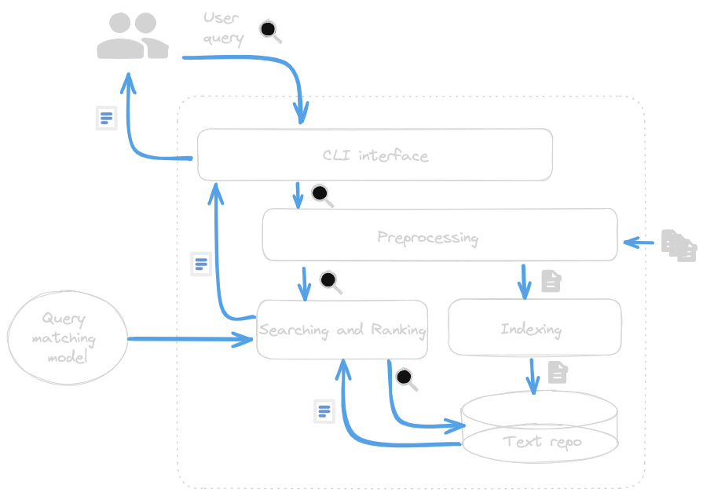

# [salton](https://en.wikipedia.org/wiki/Gerard_Salton)

🚧   🚧

## Project description

Salton is a vertical search engine built on a corpus of documents sourced from [CORE](https://core.ac.uk), a public repository of open-access research papers.
The goal is to provide a more refined search experience than the CORE portal.
It uses the [Okapi BM25](https://en.wikipedia.org/wiki/Okapi_BM25) ranking function to estimate the relevance of documents.
End users can formulate queries based on a defined language, results are ranked by relevance with title, score, URL and summary of the abstract.

## Architecture



## Running the project

This project runs using Python 3 and pip. To install it as a Python package, do the following:

1. Clone the repository and change directory

```bash
$ git clone https://github.com/stefanoghinelli/salton.git
$ cd salton
```

2. Install from source

```bash
$ python3 -m venv venv
$ source venv/bin/activate
$ pip install -e .
```

3. Download NLTK corpora

```bash
$ python3 -c "import ssl, nltk; ssl._create_default_https_context=ssl._create_unverified_context; [nltk.download(p) for p in ['punkt','stopwords','omw-1.4','wordnet','averaged_perceptron_tagger']]"
```

4. Setup environment

```bash
$ sh setup_scripts/01.prepare_environment.sh
```

## Command details

```bash
Usage: salton [OPTIONS] COMMAND [ARGS]...

  Salton: your tool for retrieving papers faster

Options:
  --help  Show this and exit.

Commands:
  fetch       Fetch papers from CORE repository
  preprocess  Tokenize, lemmatize, remove stopwords
  index       Build the index
  search      Query papers by keyword
  stats       Show statistics
  benchmark   Run benchmarks
```

### Usage

The project builds Salton locally for command line running.

To fetch papers (100 by default):

```bash
$ salton fetch -l [number of papers]
```

To preprocess papers:

```bash
$ salton preprocess [--wsd]
```

`--wsd`: enables word sense disambiguation (off by default)

> [!NOTE]
> The word sense disambiguation computes similarity between word senses and compares each term against multiple context. This quadratic operation can be highly time consuming.

To build the index:

```bash
$ salton index
```

To query papers by keyword:

```bash
$ salton search -q "[your query]" -l [number of results]
```

To view the statistics:

```bash
$ salton stats

Index statistics:
-Documents indexed: 55
-Unique terms: 17041
-Index size: 8.41 MB

Data statistics:
-Raw papers: 61
-Processed papers: 55

Benchmark statistics:
-Available query sets: 3
```

## Evaluation

### Setup benchmarks
To run benchmarks, you'll need aset of test queries in the `evaluation` directory:
   - `query_natural_lang.txt`: natural language queries
   - `query_benchmark.txt`: structured queries
   - `query_relevance.txt`: relevance data

### Benchmark metrics
The currently supported metrics are precision, recall, NDCG, MAP.

To run benchmarks:

```bash
$ salton benchmark [--save/--no-save] [--detailed/--simple]
```

`--save/--no-save`: results to file (default: save)

`--detailed/--simple`: level of detail in results (default: simple)

## Results

```bash
salton search -q "artificial intelligence" -l 3

==================================================
  Results for: artificial intelligence
==================================================

1. Title: SIR A New Wireless Sensor Network Routing Protocol Based on Artificial Intelligence
   Score: 23.8540
   Abstract: Currently, Wireless Sensor Networks (WSNs) are formed by hundreds of
             low energy and low cost micro-electro-mechanical systems. However,
             conventional Quality of Service routing models, are not suitable for
             ad hoc sensor networks, due to the dynamic nature of such systems.
   URL: https://core.ac.uk/download/161255615.pdf

2. Title: A motion system for social and animated robots
   Score: 9.9541
   Abstract: The social robot Probo is used to study Human-Robot Interactions
             (HRI), with a special focus on Robot Assisted Therapy (RAT). The
             motion system has a Combination Engine, which combines motion commands
             that are triggered by a human operator with motions that originate
             from different units of the cognitive control architecture of the
             robot.
   URL: https://core.ac.uk/download/55844762.pdf

3. Title: On the Collaboration of an Automatic Path-Planner and a Human User for Path-Finding in Virtual Industrial Scenes
   Score: 6.3338
   Abstract: This paper describes a global interactive framework enabling an
             automatic path-planner and a user to collaborate for finding a path in
             cluttered virtual environments. The user can then influence the
             planner by not following the path and automatically order a new path
             research.
   URL: https://core.ac.uk/download/12043111.pdf
```